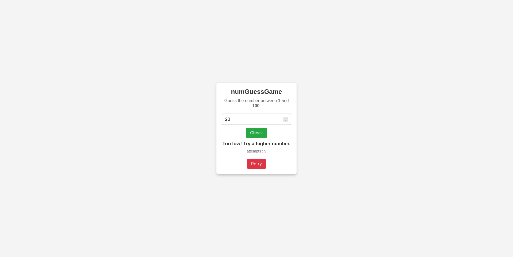

# numGuessGame

This is a simple **Number Guesser Game** where the player tries to guess a randomly generated number between 1 and 100. The game provides feedback on whether the guessed number is "Too High" or "Too Low," and tracks the number of attempts remaining.

## Features

- Guess a number between 1 and 100.
- Receive hints if the guess is too high or too low.
- Limited attempts to guess the correct number (10 attempts by default).
- Option to reset and play a new game with a different random number.


## Try the Game

You can test the game live here: [NumGuessGame](https://num-guesser-game.vercel.app/)

## Technologies Used

- **HTML** - for creating the basic structure of the game.
- **CSS** - for styling and making the interface user-friendly.
- **JavaScript** - for game logic and interaction.

## Getting Started

### Prerequisites

- A modern web browser.

### Installation

1. Clone or download this repository to your local machine.
   
   ```bash
   git clone https://github.com/WassCodeur/numGuessGame.git
   ```

2. Open the `index.html` file in your browser to start the game.

### How to Play

1. Enter a number between 1 and 100 in the input field.
2. Click the "Check" button to submit your guess.
3. You will receive feedback on whether your guess is too high or too low.
4. You have a limited number of attempts (10) to guess the correct number.
5. If you wish to play again, click the "Reset" button to start a new game.

## Game Files

- **index.html** - The main HTML structure of the game.
- **assets/styles/style.css** - Contains the styling for the game layout.
- **assets/js/index.js** - Contains the game logic, including generating the random number, checking the user's guess, and handling the reset functionality.

## Screenshot


*A simple interface with input, feedback, and controls.*

## Contributing

1. Fork the repository.
2. Create a new branch.
3. Make your changes and commit them.
4. Push to your branch.
5. Create a pull request.


## Acknowledgments

Thanks for trying out this Number Guesser Game! Feel free to contribute or share your feedback.
